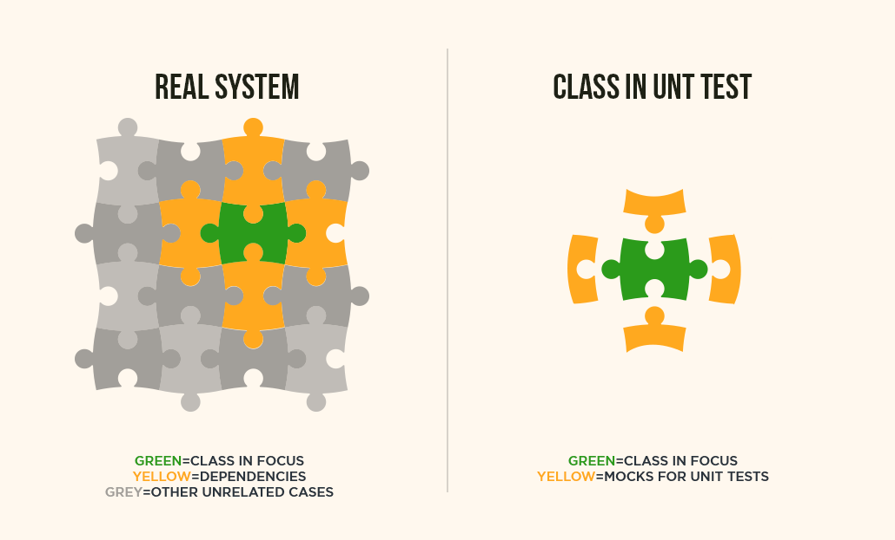

summary: Overview - Unit Testing
id: overview_unit_test
categories: Mobile Development with Flutter
tags: Scerrn, UI, Presenter, Test, Widget Test
status:  Active
authors: Alireza Khakpour

<style>
r { color: Red }
o { color: Orange }
g { color: Green }
</style>

# Overview - Unit Testing

## Introduction


By writing tests we can ensure that the app continues to work as we add more features or change existing functionality.


  - **Unit Test**: Unit tests are verifying the behavior of a single function, method, or class. The [test](https://pub.dev/packages/test) package provides the core framework for writing unit tests.
  - **Widget Test**: Because of nature of Flutter that all part of UI is Widget and written in Dart code. We can write UI component test like Unit tests in Flutter, and the [flutter_test](https://api.flutter.dev/flutter/flutter_test/flutter_test-library.html) package provides utilities for testing widgets.


## Unit Test

Writing Unit Tests helps you to confidently build new features, minimize bugs and refactor existing code. It also forces you to write better, more maintainable code that can be easily tested. with Unit test we following two important purposes:
* Making sure intended behavior is satisfied, also helps if someone else comes to our code easily understands the purpose of the unit.
* Making sure bad input/state does not cause undefined behavior we do not expect in the program.

> **Characteristics of a good unit test**
> * **Fast**. Unit tests should take very little time to run. Milliseconds.
> * **Isolated**. Unit tests are standalone, can be run in isolation, and have no dependencies on any outside factors such as a file system or database.
> * **Repeatable**. Running a unit test should be consistent with its results, that is, it always returns the same result if you do not change anything in between runs.
> * **Self-Checking**. The test should be able to automatically detect if it passed or failed without any human interaction.
> * **Timely**. A unit test should not take a disproportionately long time to write compared to the code being tested. [more info](https://docs.microsoft.com/en-us/dotnet/core/testing/unit-testing-best-practices)

## Mocking

**Mocking** is a way of simulating parts of your app that are outside the scope of the test so that they behave in specific way. Sometimes, unit tests might depend on classes that fetch data from web services or databases. This is inconvenient for a few reasons:

- Calling live services or databases slows down test execution.
- A passing test might start failing if a service or database returns unexpected results. 
- It is difficult to test all possible success and failure scenarios.

To prevent we can mock dependencies by creating an alternative implementation of a class or make use of the [Mockito](https://pub.dev/packages/mockito) package as a shortcut.
## Test Anatomy

* `setUp` and `setUpAll` method, Registers a function to be run before tests. the difference is `setUp` method will be called the function before each test is run. but `setUpAll` calls the Registered function once before all tests. we should prefer `setUp`, and only use `setUpAll` if the callback is slow.
* `tearDown` and `tearDownAll` method, Registers a function to be run after tests. the difference is `tearDown` method will be called the function after each test is run. but `setUpAll` calls the Registered function once after all tests.


* Tests can be grouped together using the `group()` function. Each group's description is added to the beginning of its test's descriptions. 

* `test()` creates a new test case with the given description and body. test body should call the specific functionality of the unit that needs to test and then assert the intended behavior of the unit.

> It's a good practice to have only one `expect` per test, It makes a little more boilerplate for a common setup. but in a test failure, the test case gives you very meaningful information.


```
import 'package:test/test.dart';

void main() {

  setUp(() {
    //TODO: Registers a function to be run before tests.
  });

  tearDown(() {
    //TODO: Registers a function to be run after tests.
  });

  group('A group of test description', () {

    test('Test #1 description, () {

      //TODO 1st step: provide functionality

      //TODO 2nd step: get the result of step 1

      //TODO 3rd step: verify the intended behavior

    });

    test('Test #2 description', () {});
    
  });
}
```

## Sample Unit Test


## Widget Test

A widget test (UI component test) tests a single widget. Testing a widget involves multiple classes and requires a test environment that provides the appropriate widget lifecycle context, Widget tests following two important purposes:
* How application handles user actions such as tap button, input data.
* Whether the visual elements (buttons, text fields, images, and so on) are displayed correctly and work as intended.

The body of the testWidgets:
```
testWidgets('Widget test description',
        (tester) async {
      
      // 1st step: Create the test Widget.

      // 2nd step: Build the widget by pumpWidget through the tester.

      // 3rd step: Create the Finders.

      // 4th step: Use matchers to verify the appearance of the widget in the widget tree.
      
    });

```

* 1- Create a widget to test 

```
 MaterialApp myWidget = MaterialApp(
      home: ExampleScreen(
          viewModel: exampleViewModel,
          pressenterAction: mockPressenterAction),
    );
```
* 2- Build the test widget inside the test environment by using the `pumpWidget()` method. 

- The `pumpWidget` method builds and renders the provided widget.
- `tester.pump(Duration duration)` method provides additional ways to rebuild the same widget. This is useful if you’re working with a StatefulWidget or animations. For example, tapping a button. 
- `tester.pumpAndSettle()` Repeatedly calls pump() with the given duration until there are no longer any frames scheduled. 

* 3- use the Finder to locate widgets in a test environment

Most common finder method:

find.byKey() : Finds widgets by searching for one with a particular [Key].
find.byType() : Finds widgets by searching for widgets with a particular type.
find.text() : Finds [Text] and [EditableText] widgets containing string equal to the text argument.


* 4- Verify the widget using a Matcher

Finally, verify the objects that appear on the screen using the Matcher constants. 
Ensure that the widgets appear on screen exactly one time. For this purpose, use the findsOneWidget Matcher.

Additional Matchers
- `findsNothing` Verifies that no widgets are found.
- `findsWidgets` Verifies that one or more widgets are found.
- `findsNWidgets`
Verifies that a specific number of widgets are found.
- `matchesGoldenFile` Verifies that a widget’s rendering matches a particular bitmap image (“golden file” testing).

## Sample Widget Test


claat export overview_unit_test.md  